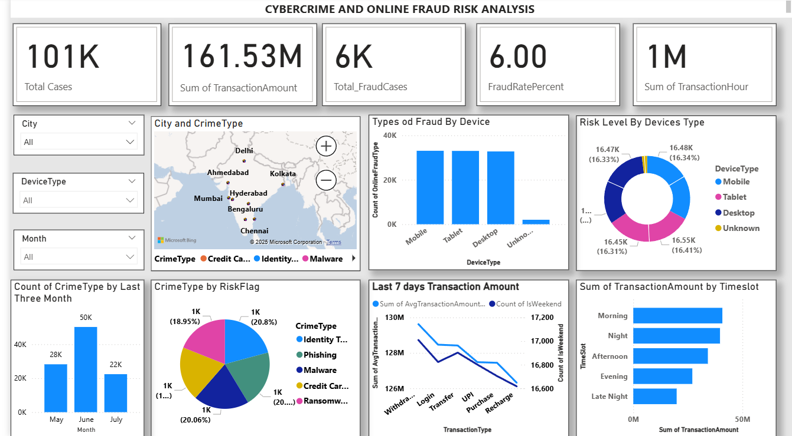

#  Cybercrime and Online Fraud Risk Analysis

A powerful Power BI dashboard to visualize, track, and analyze **cybercrime** and **online fraud patterns** across Indian cities. This project offers actionable insights into fraud trends, device vulnerabilities, and high-risk regions using data-driven visual storytelling.

---

##  Project Overview

-  **Dataset**: Cleaned synthetic dataset with over **100K+ records**
-  **Tools Used**: Power BI, Excel, Python (optional for preprocessing)
-  **Domain**: Cybersecurity & Financial Fraud Analytics
-  **Objective**: Identify online fraud risks, device trends, and transaction behaviors to aid better decision-making and risk mitigation

---

##  Key Highlights

- **Total Cases Analyzed**: `101K+`
- **Transaction Volume**: ₹`161.53 Million+`
- **Fraudulent Cases**: `6K+`
- **Fraud Rate**: `6.00%`
- **High-Risk Crime Types**: Identity Theft, Phishing, Credit Card Fraud, Malware
- **Top Affected Cities**: Mumbai, Bengaluru, Hyderabad, Delhi, Chennai
- **Peak Crime Month**: June

---

##  Visuals & Analytics Included

-  **KPI Cards**: Total Cases, Fraud Cases, Amounts, Hours
-  **Map View**: City-wise crime distribution
-  **Bar & Column Charts**: Monthly crime trends, device-based fraud counts
-  **Donut & Pie Charts**: Risk levels, crime type share
-  **Time Slot Analysis**: Transaction volume by time of day
-  **7-Day Transaction Trend**: Line chart for average amounts
-  **Interactive Slicers**: Filter by City, Device Type, Month, Crime Type

-  

---

##  RiskFlag Classification

- 🔵 **Low**: No serious indicators
- 🟡 **Medium**: Moderate suspicious patterns
- 🔴 **High**: Strong fraud signals based on behavior, amount, and device

---

##  Project Files

- `Cleaned_Cybercrime_New.csv` – Final cleaned dataset used in dashboard
- `Cybercrime_Analysis.pbix` – Power BI file (optional if sharing)
- `Dashboard_SS.png` – Dashboard snapshot for preview

---

##  Future Enhancements

-  Integrate a **fraud prediction model** (e.g., Random Forest)
-  Add **drill-through reports** for case-level insights
-  Export visual insights to **PDF** or **web app**
-  Add toggle between **Amount vs Risk Level** views

---

##  How to Use This Project

1. Download the `.pbix` file (Power BI)
2. Open it using **Power BI Desktop**
3. Use slicers and charts to explore fraud patterns
4. Customize for your own fraud datasets or regions

---

##  Connect with the Creator

> **Name**: Sakthi Kumar B  

> **Email**: **b.sakthikumar10@gmail.com**

>**GitHub**: [GitHub (sakthikumar-1)](https://github.com/sakthikumar-1)  

>**LinkedIn**: [LinkedIn (sakthikumar1)](https://linkedin.com/in/sakthikumar1)  

---

-**Feel free to explore, fork, or contribute to this project. Your feedback and suggestions are always welcome!**

